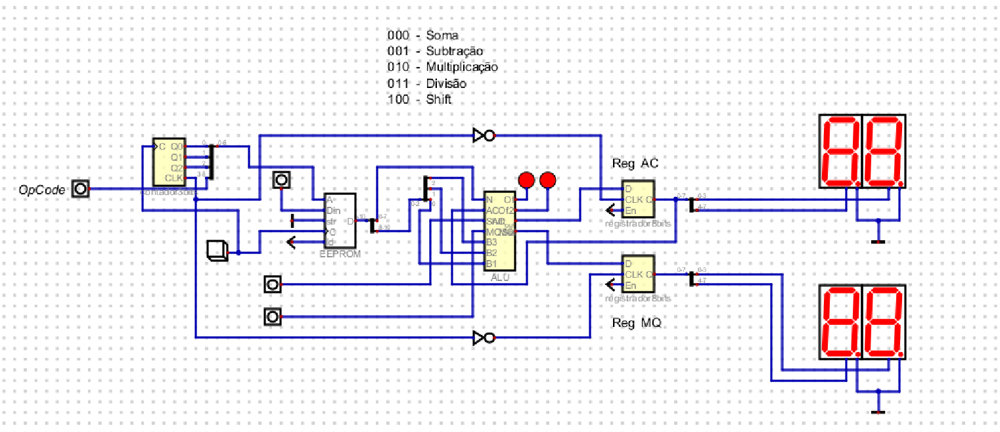

## CPU 8 BITS — Arquitetura SAP

### 1. Visão geral

Esta CPU de 8 bits foi desenvolvida no simulador Digital seguindo a arquitetura SAP (Simple As Possible). O princípio central é a comunicação por barramento compartilhado: todos os blocos da CPU — memórias, registradores, unidade aritmética — se conectam ao mesmo fio de 8 bits, e um sistema de controle determina quem pode escrever e quem deve ler a cada instante.

O resultado é uma máquina capaz de executar programas armazenados em memória, realizando operações aritméticas e lógicas com acumulação de resultados entre instruções. O ciclo de execução é dividido em quatro fases fixas, cadenciadas por um ring counter que funciona como o relógio interno da CPU.

---

### 2. Arquitetura Geral

A CPU é composta por oito blocos funcionais interligados pelo W BUS. Cada bloco tem um papel específico dentro do ciclo fetch-decode-execute, e a comunicação entre eles é mediada por drivers tristate e sinais de controle gerados pelo ring counter.

#### 2.1 Visão dos componentes

| Componente         | Arquivo                | Papel no sistema                                               |
|--------------------|------------------------|----------------------------------------------------------------|
| Program Counter    | contador4bits.dig      | Mantém o endereço da instrução atual e incrementa a cada ciclo |
| MAR               | embutido               | Registra o endereço antes de apresentá-lo à EEPROM responsável pelas operações    |
| EEPROM - operações     | embutida               | Memória de 16×8 bits que armazena o programa                   |
| Instruction Register   | embutido               | Trava a instrução lida e separa opcode do endereço do operando |
| EEPROM - operandos        | embutida               | Memória de 32×8 bits que armazena os operandos                 |
| REG_B              | embutido               | Guarda o operando antes da ALU                                 |
| ALU                | ALU.dig                | Executa as 8 operações e produz AC (resultado) e MQ (secundário)|
| Ring Counter (CC)  | ring-counter.dig       | Gera os sinais de controle em sequência fixa de 4 fases        |

#### 2.2 O W BUS e os drivers tristate

O barramento W BUS é um fio de 8 bits compartilhado por todos os componentes. Para evitar conflitos, cada componente que precisa colocar dados no BUS tem um driver tristate na sua saída, controlado pelo ring counter.

#### 2.3 Sinais de controle

O ring counter é responsável por gerar uma sequência de sinais de controle que coordenam o funcionamento de todos os blocos da CPU. Esses sinais são fundamentais para garantir que, a cada ciclo de clock, apenas o componente correto tenha acesso ao barramento compartilhado, evitando conflitos e garantindo a correta execução das instruções.

Cada fase do ciclo de máquina ativa um conjunto específico de sinais, determinando, por exemplo, quando o endereço do programa é colocado no barramento, quando a instrução é lida da memória, quando o operando é buscado, e quando a operação aritmética ou lógica é realizada pela ALU. Além disso, esses sinais controlam o carregamento de dados nos registradores, a atualização do acumulador e o avanço do contador de programa.

O uso do ring counter simplifica o controle da CPU, pois permite que o fluxo de dados e comandos siga uma ordem fixa e previsível, dispensando a necessidade de lógica de decodificação complexa. Assim, a sincronização entre os módulos ocorre de forma automática, tornando o projeto mais robusto e fácil de depurar.

---

### 3. Componentes em Detalhe

- **Program Counter (PC):** Contador binário de 4 bits, endereça até 16 posições de memória.
- **MAR:** Registrador de 4 bits, estabiliza o endereço para a EEPROM de operações.
- **EEPROM - operações:** 16×8 bits, armazena instruções (3 bits opcode + 5 bits endereço).
- **Instruction Register (IR):** 8 bits, separa opcode (3 bits) e endereço do operando (5 bits).
- **EEPROM - operandos:** 32×8 bits, armazena operandos, endereçada pelos 5 bits do IR.
- **REG_B:** 8 bits, guarda o operando até a ALU processar.
- **ALU:** Recebe AC e N, executa operação selecionada pelo opcode.
- **Ring Counter:** 4 flip-flops D, controla as 4 fases do ciclo de execução.

---

### 4. Ciclo de Execução

Cada instrução é processada em quatro fases sequenciais:

| Fase | Sinal ativo                | O que circula no BUS         | O que acontece                                      |
|------|----------------------------|------------------------------|-----------------------------------------------------|
| 0  | PC_EN, MAR           | Endereço do PC               | PC coloca endereço no BUS, MAR captura             |
| 1   | operações_EN, IR_LOAD, CLK_PC| Instrução de 8 bits          | EEPROM - operações lê, IR trava, PC incrementa          |
| 2   | operando_EN, B         | Operando de 8 bits           | IR direciona endereço, operando aparece no BUS      |
| 3   | ALU, AC_LOAD            | (BUS livre)                  | ALU executa, grava resultado em AC e MQ             |

---

### 5. Formato da Instrução

Cada instrução ocupa 8 bits:

- 3 bits mais significativos: opcode
- 5 bits menos significativos: endereço do operando

Valor = (opcode × 32) + endereço_operando

Exemplo: opcode 2 (multiplicação), endereço 1 → (2×32)+1 = 65 = 0x41

---

### 6. Programa de Demonstração

#### 6.1 Conteúdo da EEPROM - operações

| PC  | Hex  | Binário   | Opcode | Endereço N | Instrução                       |
|-----|------|-----------|--------|------------|---------------------------------|
| 0x0 | 0x00 | 00000000  | 000    | 0x00       | AC = AC + operandos[0x00]       |
| 0x1 | 0x41 | 01000001  | 010    | 0x01       | AC = AC × operandos[0x01]       |
| 0x2 | 0xA0 | 10100000  | 101    | —          | AC = AC << 1                    |
| 0x3 | 0x22 | 00100010  | 001    | 0x02       | AC = AC − operandos[0x02]       |
| 0x4 | 0x80 | 10000000  | 100    | —          | AC = AC >> 1                    |
| 0x5 | 0x63 | 01100011  | 011    | 0x03       | AC = resto · MQ = quociente     |

#### 6.2 Conteúdo da EEPROM - operandos

| Endereço | Valor | Usado em                |
|----------|-------|------------------------|
| 0x00     | 6     | Instrução 0 (Soma)     |
| 0x01     | 4     | Instrução 1 (Multiplicação) |
| 0x02     | 10    | Instrução 3 (Subtração)|
| 0x03     | 7     | Instrução 5 (Divisão)  |

#### 6.3 Execução passo a passo

| # | Operação      | N  | Cálculo         | AC após | MQ após |
|---|--------------|----|-----------------|---------|---------|
| 1 | Soma         | 6  | 0 + 6 = 6       | 6       | 0       |
| 2 | Multiplicação| 4  | 6 × 4 = 24      | 24      | 0       |
| 3 | Shift esq.   | —  | 24 << 1 = 48    | 48      | 0       |
| 4 | Subtração    | 10 | 48 − 10 = 38    | 38      | 0       |
| 5 | Shift dir.   | —  | 38 >> 1 = 19    | 19      | 0       |
| 6 | Divisão      | 7  | 19 ÷ 7 = 2 | 5       | 2       |

---

### 7. Saída Visual — Displays de 7 Segmentos

Os resultados de AC e MQ são exibidos tanto em seus valores decimais em si, quanto em displays de 7 segmentos hexadecimais, usando splitters para separar os nibbles alto e baixo.

---

### 8. Decisões de Projeto

- **Duas EEPROMs separadas:** Facilita o acesso a instruções e dados.
- **Ring counter:** Controle simples e eficiente, sem microinstruções.
- **Opcode direto para a ALU:** Simplifica o controle.
- **MAR como buffer:** Mantém o endereço estável durante a leitura.

---

### 9. Vídeo explicativo da solução